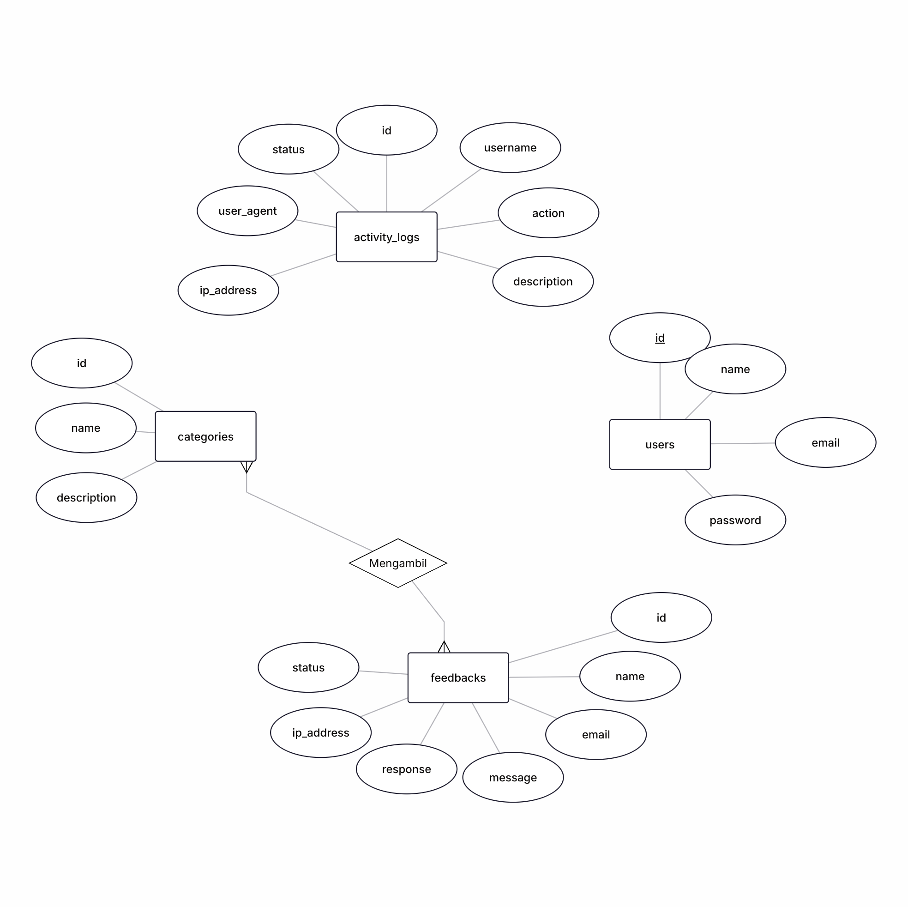

# Feedback Box Digital Dinas Ketahanan Pangan

Aplikasi Laravel 10 untuk mengelola pengaduan dan saran masyarakat Kabupaten Garut. Sistem ini menyatukan formulir publik yang ramah pengguna, panel admin dengan workflow status lengkap, ekspor arsip, hingga log aktivitas demi audit internal.

## Gambaran Umum Web
- **Tujuan**: menampung aspirasi publik secara terstruktur, menindaklanjuti sesuai kategori, dan memberi transparansi ke pimpinan.
- **Peran Pengguna**: masyarakat (kirim aspirasi), admin/operator (olah & respon), supervisor IT (monitor keamanan/log).
- **Hasil Sistem**: dashboard status, daftar pengaduan dengan filter komprehensif, tanggapan admin, riwayat status, dokumen ekspor CSV/PDF.
- **Tech stack**: Laravel 10 (PHP 8.2), MySQL/SQLite, Blade + Tailwind, Axios/Fetch untuk AJAX, Vite untuk aset.

## Modul & Fitur Utama
### 1. Pengalaman Publik
- Landing page berisi hero, informasi dinas, layanan unggulan, dan CTA login admin.
- Form feedback AJAX dengan field nama, email, kategori (sinkron endpoint `/api/categories`), dan pesan.
- Validasi sisi server + client, notifikasi sukses/gagal, serta pelacakan IP untuk keamanan.

### 2. Panel Admin
- Login khusus guard `auth.admin` dengan proteksi CSRF & rate limit bawaan Laravel.
- Dashboard metrik: total pengaduan, status terbaru, dan tombol cepat menuju daftar tertentu.
- Modul pengaduan: tabel responsif + pencarian teks penuh, filter status/kategori/tanggal, pagination, detail lengkap, tanggapan admin, perubahan status (`baru → diproses → selesai`).
- Modul kategori: CRUD dengan validasi unik dan pencegahan penghapusan ketika sedang dipakai.

### 3. Aktivitas & Pelaporan
- Activity log menyimpan `admin_username`, aksi (`login`, `update_status`, `export_pdf`, dst), IP, user agent, dan status.
- Ekspor CSV atau PDF sesuai filter aktif untuk bahan laporan bulanan.
- Riwayat status per pengaduan membantu audit tindak lanjut.

## Dokumentasi Pengguna & Alur Kerja
### Alur operasional singkat
1. Masyarakat membuka halaman utama dan mengirim form feedback.
2. Sistem mencatat data + status awal "baru" dan mengirim notifikasi sukses.
3. Admin login, memantau dashboard, lalu membuka daftar pengaduan.
4. Admin membaca detail, menambahkan tanggapan, mengubah status ke "diproses" atau "selesai".
5. Supervisor IT mengecek Activity Log berkala untuk mendeteksi anomali.

### Rute Publik
| Method | Endpoint | Deskripsi | Middleware |
|--------|----------|-----------|------------|
| GET | `/` | Landing page + formulir | `web`
| POST | `/feedback` | Simpan pengaduan (respons JSON) | `throttle:web`
| GET | `/api/categories` | Daftar kategori aktif | `api`

### Rute Panel Admin
| Method | Endpoint | Deskripsi | Middleware |
|--------|----------|-----------|------------|
| GET/POST | `/admin/login` | Form + proses login | `guest:admin`
| POST | `/admin/logout` | Akhiri sesi admin | `auth.admin`
| GET | `/admin` | Dashboard utama | `auth.admin`
| GET | `/admin/feedback` | Daftar pengaduan + filter | `auth.admin`
| GET | `/admin/feedback/{id}` | Detail, tanggapan, riwayat status | `auth.admin`
| POST | `/admin/feedback/{id}/status` | Perbarui status `baru/diproses/selesai` | `auth.admin`
| POST | `/admin/feedback/{id}/response` | Simpan tanggapan admin | `auth.admin`
| Resource | `/admin/categories` | CRUD kategori | `auth.admin`
| GET | `/admin/activity-logs` | Monitoring aksi admin | `auth.admin`
| GET | `/admin/export/{csv|pdf}` | Ekspor sesuai filter aktif | `auth.admin`

### Hak akses ringkas
| Peran | Hak | Catatan |
|-------|-----|---------|
| Masyarakat | Submit pengaduan via form publik | Tidak perlu login |
| Admin / Operator | Semua modul admin: dashboard, feedback, kategori, ekspor | Guard khusus `auth.admin` |
| Supervisor IT | Hak admin + fokus pada Activity Log dan konfigurasi | Biasanya menggunakan akun admin senior |

## Instalasi & Menjalankan Proyek
1. **Persyaratan**: PHP 8.2+, Composer 2+, MySQL 8/ MariaDB 10 (atau SQLite), Node.js 18+ bila butuh kompilasi aset.
2. **Clone & dependency**
   ```bash
   git clone <repo-url>
   cd feedbackbox
   composer install
   npm install   # opsional bila perlu Vite dev server
   ```
3. **Konfigurasi environment**
   ```bash
   cp .env.example .env
   php artisan key:generate
   ```
   Atur koneksi database di `.env` (contoh):
   ```dotenv
   DB_CONNECTION=mysql
   DB_HOST=127.0.0.1
   DB_PORT=3306
   DB_DATABASE=feedbackbox
   DB_USERNAME=root
   DB_PASSWORD=secret
   ```
4. **Migrasi & seeding**
   ```bash
   php artisan migrate --seed
   ```
   Perintah ini membuat tabel users, categories, feedbacks, activity_logs, sessions, lalu mengisi user admin & kategori contoh.
5. **Menjalankan aplikasi**
   ```bash
   php artisan serve --host 127.0.0.1 --port 8000
   npm run dev   # atau npm run build untuk produksi
   ```

## Akun Bawaan
| Area | URL | Username | Password |
|------|-----|----------|----------|
| Admin Panel | `http://localhost:8000/admin/login` | `admin` | `admin123` |

## Struktur Direktori Singkat
```
app/
├── Http/
│   ├── Controllers/ (FeedbackController, Admin/*, AuthController)
│   ├── Middleware/ (Authenticate, AdminAuth)
│   └── Requests/FeedbackRequest.php
├── Models/ (Feedback, Category, ActivityLog, User)
├── Services/ActivityLogService.php
bootstrap/
config/
docs/ (SYSTEM_DOCUMENTATION.md, diagram, panduan internal)
resources/views/ (landing page, admin layouts, tabel, form)
routes/web.php, api.php
```

## Diagram & Arsitektur
- ERD & UML ringkas tersedia pada bagian "Database & Diagram" di `docs/SYSTEM_DOCUMENTATION.md`.
- Diagram ERD juga tersedia dalam bentuk gambar `erdplus.png` di root repo:


- ActivityLogService menjadi jembatan antara aksi admin dan tabel `activity_logs` untuk audit.

## Skema Database (detail kolom utama)
### Tabel `users`
| Kolom | Tipe | Keterangan |
|-------|------|-----------|
| `id` | bigint PK | Auto increment.
| `name` | varchar(255) | Nama admin.
| `email` | varchar(255) unique | Username login.
| `password` | varchar(255) | Disimpan sebagai hash.
| `created_at`, `updated_at` | timestamp | Metadata Laravel.

### Tabel `categories`
| Kolom | Tipe | Keterangan |
|-------|------|-----------|
| `id` | bigint PK |
| `name` | varchar(255) unique | Label dropdown form publik.
| `description` | text nullable | Penjelasan tambahan.
| `created_at`, `updated_at` | timestamp |

### Tabel `feedbacks`
| Kolom | Tipe | Keterangan |
|-------|------|-----------|
| `id` | bigint PK |
| `name` | varchar(255) | Nama pengirim.
| `email` | varchar(255) | Kontak pengirim.
| `category_id` | bigint nullable | Relasi ke `categories`.
| `message` | text | Isi pengaduan/saran.
| `admin_response` | longtext nullable | Tanggapan admin.
| `ip_address` | varchar(45) nullable | IP publik untuk audit.
| `status` | varchar(50) default `baru` | Enum logis `baru/diproses/selesai`.
| `created_at`, `updated_at` | timestamp |

### Tabel `activity_logs`
| Kolom | Tipe | Keterangan |
|-------|------|-----------|
| `id` | bigint PK |
| `admin_username` | varchar(255) | User yang melakukan aksi.
| `action` | varchar(100) | Label tindakan.
| `description` | text nullable | Detil tambahan.
| `ip_address` | varchar(45) nullable | IP perangkat admin.
| `user_agent` | varchar(255) nullable | Browser/perangkat.
| `status` | varchar(50) default `success` | `success/failed/error`.
| `created_at`, `updated_at` | timestamp |

## Pengujian & Operasional
- Jalankan `php artisan test` sebelum rilis untuk memastikan validasi dan middleware berjalan.
- Gunakan `npm run build` sebelum deploy agar aset terkompilasi.
- Pantau `storage/logs/laravel.log` dan modul Activity Log untuk mendeteksi error atau percobaan akses ilegal.
- Backup database secara berkala (`mysqldump feedbackbox` atau salin file SQLite) dan pastikan `APP_DEBUG=false` di produksi.

Dokumentasi lanjutan, panduan admin, serta catatan keamanan lengkap ada di `GETTING_STARTED_ADMIN.md` dan `docs/SYSTEM_DOCUMENTATION.md`.
