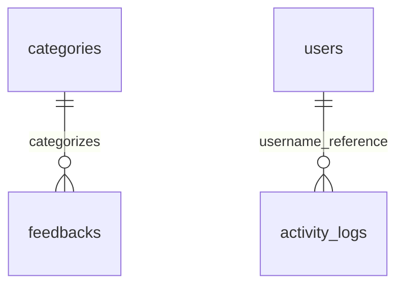
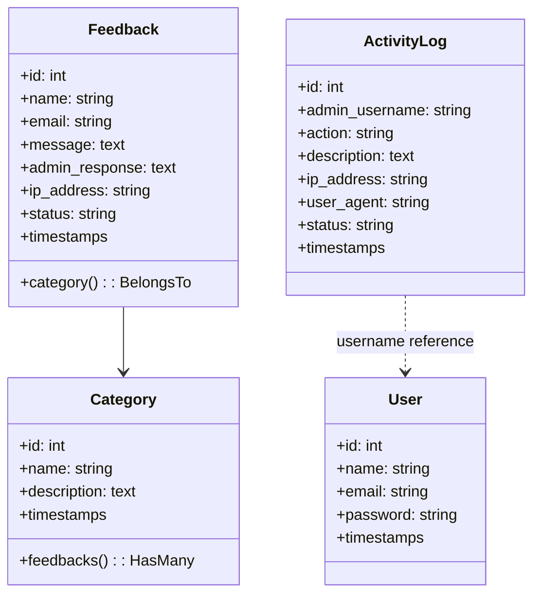

# Sistem Dokumentasi Feedback Box

## 1. Tujuan Produk
- Memusatkan keluhan, pertanyaan, dan saran masyarakat ke satu kanal resmi Dinas Ketahanan Pangan Kabupaten Garut.
- Menyediakan workflow yang jelas bagi admin untuk memverifikasi, merespons, dan menutup pengaduan.
- Mencatat setiap tindakan penting untuk audit internal dan peningkatan layanan.

## 2. Gambaran Pengalaman Web
### 2.1 Landing Page Publik
1. **Header & navigasi** – Logo dinas, tautan ke bagian Tentang, Layanan, Formulir, dan tombol menuju login admin.
2. **Hero section** – CTA ajakan menyampaikan aspirasi serta tombol langsung menuju formulir.
3. **Tentang Dinas** – Menjelaskan visi, program unggulan, dan komitmen pelayanan.
4. **Layanan & Nilai Tambah** – Menonjolkan benefit menggunakan sistem digital vs kanal manual.
5. **Formulir Feedback** – Input nama, email, kategori (diisi via endpoint `/api/categories`), dan pesan.
6. **Pemberitahuan Status** – Setelah submit muncul notifikasi sukses atau error validasi secara AJAX.
7. **Kontak & Lokasi** – Info alamat, nomor telepon, serta peta sederhana.

### 2.2 Panel Admin
- **Halaman Login** – Autentikasi form tradisional, dilindungi CSRF token dan rate-limit bawaan Laravel.
- **Dashboard** – Widget angka total, kartu status, grafik tren (jika data tersedia), serta quick links untuk status tertentu.
- **Daftar Pengaduan** – Tabel responsif, pagination, filter gabungan (status/kategori/tanggal), pencarian fuzzy, dan aksi cepat.
- **Detail Pengaduan** – Menampilkan metadata pengirim, isi pesan, riwayat status, catatan IP, dan form tanggapan admin.
- **Kelola Kategori** – CRUD inline dengan validasi unik serta perlindungan saat kategori sedang dipakai.
- **Activity Log** – Timeline aksi admin (login, ubah status, export, dsb) dengan status `success/failed/error`.

## 3. Aktor & Alur Pengguna
| Peran | Sasaran | Langkah Utama |
|-------|---------|---------------|
| Masyarakat | Menyampaikan aspirasi | Buka halaman utama → baca informasi → isi form → kirim → menerima konfirmasi |
| Admin Dinas | Menangani pengaduan | Login → pantau dashboard → buka daftar → baca detail → tambah tanggapan → ubah status → arsipkan |
| Supervisor IT | Audit & dukungan | Monitor activity log → pantau konfigurasi → bantu reset akun jika diperlukan |

## 4. Rute & API
### Rute Publik
| Method | URI | Kontroler | Deskripsi |
|--------|-----|-----------|-----------|
| GET | `/` | `FeedbackController@index` | Render landing page.
| POST | `/feedback` | `FeedbackController@store` | Simpan pengaduan (validasi server-side, respons JSON).
| GET | `/api/categories` | `FeedbackController@getCategories` | JSON daftar kategori aktif.

### Rute Admin
| Method | URI | Kontroler | Catatan |
|--------|-----|-----------|---------|
| GET | `/admin/login` | `AuthController@showLogin` | Halaman login.
| POST | `/admin/login` | `AuthController@login` | Proses autentikasi.
| POST | `/admin/logout` | `AuthController@logout` | Terminasi sesi.
| GET | `/admin` | `DashboardController@index` | Dashboard (perlu middleware `auth.admin`).
| GET | `/admin/feedback` | `Admin\FeedbackController@index` | Daftar pengaduan.
| GET | `/admin/feedback/{feedback}` | `Admin\FeedbackController@show` | Detail pengaduan.
| POST | `/admin/feedback/{feedback}/status` | `Admin\FeedbackController@updateStatus` | Ubah `status` (`baru/diproses/selesai`).
| POST | `/admin/feedback/{feedback}/response` | `Admin\FeedbackController@addResponse` | Simpan tanggapan admin.
| POST | `/admin/feedback/{feedback}/delete` | `Admin\FeedbackController@delete` | Hapus pengaduan.
| GET/POST | `/admin/categories*` | `Admin\CategoryController` | CRUD kategori.
| GET | `/admin/export/{csv|pdf}` | `Admin\ExportController` | Ekspor data.
| GET | `/admin/activity-logs*` | `Admin\ActivityLogController` | Pengarsipan log.

## 5. Keamanan, Validasi, dan Logging
- **Validasi Publik**: aturan pada `FeedbackController@store` menegakkan panjang pesan, format email, serta kategori wajib.
- **Middleware**: seluruh rute admin berada dalam grup `Route::middleware('auth.admin')`.
- **Session Driver**: default `database` sehingga sesi tersimpan di tabel `sessions` (dibuat otomatis oleh Laravel 10).
- **CSRF Protection**: token di master layout `<meta name="csrf-token">` dan form admin.
- **Activity Log**: layanan `ActivityLogService` memanggil model `ActivityLog` untuk mencatat `admin_username`, aksi, IP, user agent, dan status.
- **Export & Deletion**: aksi kritikal memerlukan POST untuk mencegah CSRF via GET.

## 6. Desain Data
### 6.1 Status Lifecycle Feedback
```
Baru → Diproses → Selesai
      ↘ (opsional) kembali ke Baru saat dibuka ulang
```
- `baru`: otomatis saat masyarakat mengirim.
- `diproses`: setelah admin menambahkan tanggapan pertama.
- `selesai`: saat kasus ditutup atau keputusan final diberikan.

### 6.2 Data Dictionary
#### `users`
| Kolom | Tipe | Keterangan |
|-------|------|------------|
| `id` | bigint PK | Auto increment.
| `name` | string | Nama admin.
| `email` | string unik | Username login.
| `password` | string | Password hash Bcrypt.
| `created_at`, `updated_at` | timestamp | Diisi Laravel.

#### `categories`
| Kolom | Tipe | Keterangan |
|-------|------|------------|
| `id` | bigint PK | Auto increment.
| `name` | string unik | Nama kategori, tampil di dropdown publik.
| `description` | text nullable | Penjelasan tambahan.
| `created_at`, `updated_at` | timestamp | Metadata.

#### `feedbacks`
| Kolom | Tipe | Keterangan |
|-------|------|------------|
| `id` | bigint PK | Auto increment.
| `name` | string | Nama pengirim.
| `email` | string | Email pengirim.
| `category_id` | bigint nullable | Referensi `categories.id` (tidak enforced FK namun digunakan di Eloquent).
| `message` | text | Isi pengaduan.
| `admin_response` | longText nullable | Jawaban dari admin.
| `ip_address` | string nullable | IP pengirim.
| `status` | string default `baru` | Enum logis (`baru/diproses/selesai`).
| `created_at`, `updated_at` | timestamp | Metadata.

#### `activity_logs`
| Kolom | Tipe | Keterangan |
|-------|------|------------|
| `id` | bigint PK | Auto increment.
| `admin_username` | string | Username admin yang melakukan aksi.
| `action` | string | Label seperti `login`, `update_status`, `export_pdf`.
| `description` | text nullable | Penjelasan detil.
| `ip_address` | string nullable | IP klien.
| `user_agent` | string nullable | Identitas perangkat.
| `status` | string default `success` | `success/failed/error`.
| `created_at`, `updated_at` | timestamp | Metadata.

### 6.3 ERD


> Catatan: secara fisik `activity_logs` hanya menyimpan `admin_username` (string) tanpa foreign key, tetapi relasi konseptual dengan `users` tetap relevan secara logis.

### 6.4 UML Model


### 6.5 Skema Database (DDL Ringkas)
```sql
CREATE TABLE categories (
    id BIGINT UNSIGNED AUTO_INCREMENT PRIMARY KEY,
    name VARCHAR(255) UNIQUE NOT NULL,
    description TEXT NULL,
    created_at TIMESTAMP NULL,
    updated_at TIMESTAMP NULL
);

CREATE TABLE feedbacks (
    id BIGINT UNSIGNED AUTO_INCREMENT PRIMARY KEY,
    name VARCHAR(255) NOT NULL,
    email VARCHAR(255) NOT NULL,
    category_id BIGINT UNSIGNED NULL,
    message TEXT NOT NULL,
    admin_response LONGTEXT NULL,
    ip_address VARCHAR(45) NULL,
    status VARCHAR(50) NOT NULL DEFAULT 'baru',
    created_at TIMESTAMP NULL,
    updated_at TIMESTAMP NULL
);

CREATE TABLE activity_logs (
    id BIGINT UNSIGNED AUTO_INCREMENT PRIMARY KEY,
    admin_username VARCHAR(255) NOT NULL,
    action VARCHAR(100) NOT NULL,
    description TEXT NULL,
    ip_address VARCHAR(45) NULL,
    user_agent VARCHAR(255) NULL,
    status VARCHAR(50) NOT NULL DEFAULT 'success',
    created_at TIMESTAMP NULL,
    updated_at TIMESTAMP NULL
);
```

## 7. Operasional & Monitoring
- **Backup**: jalankan `mysqldump feedbackboxx` atau salin file SQLite setiap hari.
- **Logging**: awasi `storage/logs/laravel.log` untuk error aplikasi.
- **Env Separation**: gunakan `APP_ENV=production`, `APP_DEBUG=false` ketika deploy.
- **Alerting**: integrasikan log aktivitas dengan sistem notifikasi internal bila diperlukan.

## 8. Referensi Cepat
- Panduan admin: `GETTING_STARTED_ADMIN.md`
- README untuk setup & ringkasan
- Kontak tim IT: `it@dinkp.garut`
